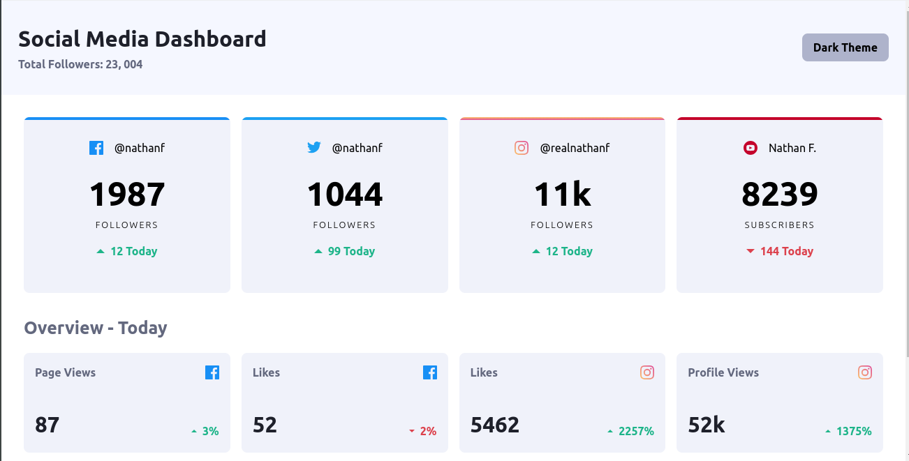
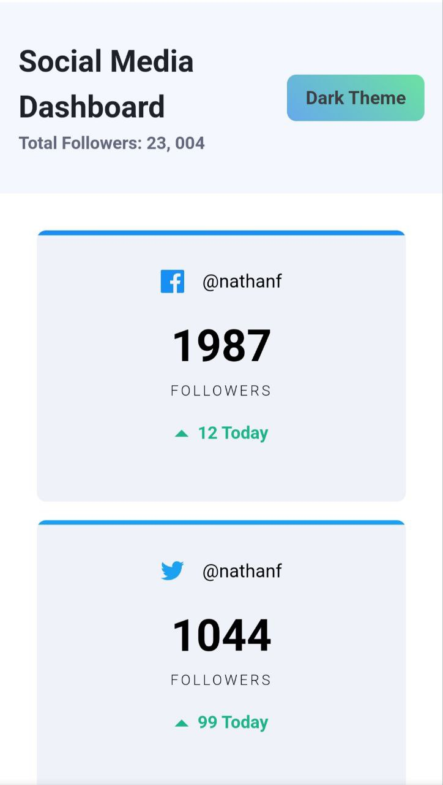
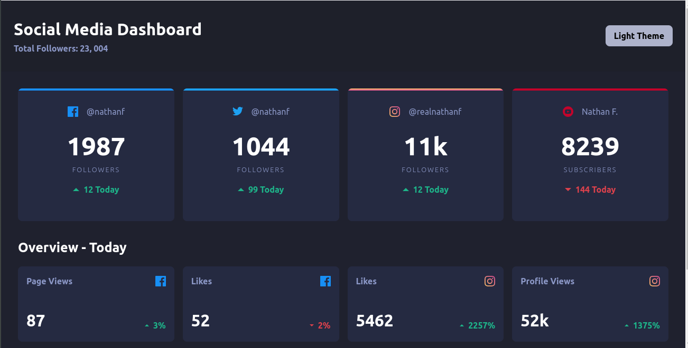
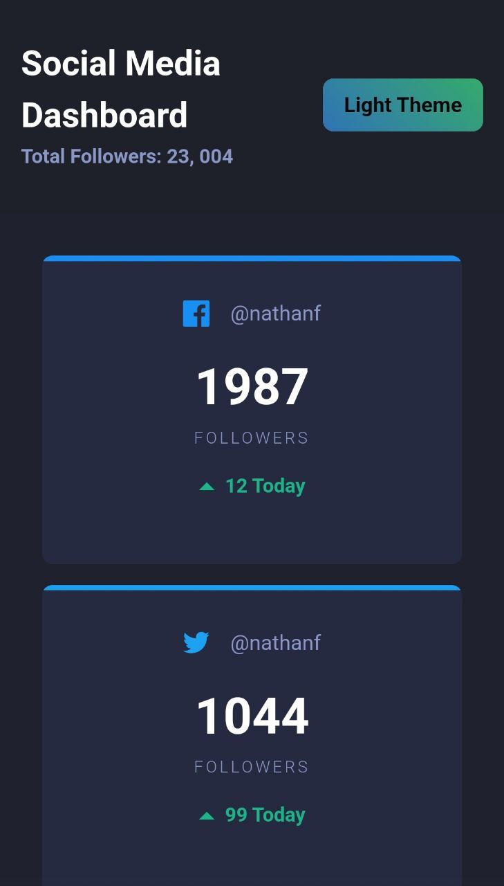

# Social Media Dashboard with Theme Switcher

This is a solution to the **Social Media Dashboard with Theme Switcher** from [Frontend Mentor](https://frontendmentor.io)

## Preview

### Light Mode

#### Desktop

#### Mobile

### Dark Mode

#### Desktop

#### Mobile

## Links

- [GitHub Repository](https://github.com/Code-Beaker/social-media-dashboard-code-beaker)'
- [Netlify Deploy](https://social-media-dashboard-code-beaker.netlify.app/)
